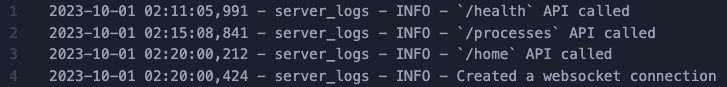

# Logging in Python
This week, we looked what logging looks like in Python. I have familiarity with logging and observability tools and frameworks like Amazon CloudWatch Logs, Cloudformation Logs, Sentry.io, DataDog, Auth0, and others. I noticed how the structure of info/debug/error are VERY similar to the types of logs I have seen in the CloudWatch logs dashboards for Lambda functions or API calls, or in Auth0 authentication logs.

# `Logger` class for processing a dataset
We will look first at the various methods for creating a logging structure when processing data in a dataset, and saving those logs to a .txt file in a `/logs` directory.
## Creating log files in a `/log` directory based on the database

### To run:
```
PYTHONPATH=.. python main.py --type tst
```

### The output in the terminal looks like this:
```bash
85000it [00:00, 646412.42it/s]
'UnitPrice'
{'25': 1.25,
 '50': 2.46,
 '75': 4.95,
 'max': 17836.46,
 'mean': 11.291125247057265,
 'median': None,
 'min': 0.001,
 'std': 326.33789059131743}
'TotalPrice'
{'25': 2.55,
 '50': 6.6,
 '75': 15.0,
 'max': 178364.59999999998,
 'mean': 40.535017341173344,
 'median': None,
 'min': 0.001,
 'std': 1450.293352932578}
85000it [00:00, 822001.07it/s]
85000it [00:00, 818124.71it/s]
90000it [00:00, 659252.57it/s]
'UnitPrice'
{'25': 1.25,
 '50': 2.46,
 '75': 4.95,
 'max': 17836.46,
 'mean': 10.192059144442679,
 'median': None,
 'min': 0.001,
 'std': 305.12369162688367}
'TotalPrice'
{'25': 2.55,
 '50': 6.58,
 '75': 14.940000000000001,
 'max': 142691.68,
 'mean': 34.022147577775236,
 'median': None,
 'min': 0.001,
 'std': 1215.827969633452}
90000it [00:00, 821617.78it/s]
90000it [00:00, 814951.92it/s]
80000it [00:00, 653786.83it/s]
'UnitPrice'
{'25': 1.25,
 '50': 2.46,
 '75': 4.95,
 'max': 17836.46,
 'mean': 10.251292749998372,
 'median': None,
 'min': 0.001,
 'std': 304.7065793845803}
'TotalPrice'
{'25': 2.55,
 '50': 6.6,
 '75': 14.95,
 'max': 160528.13999999998,
 'mean': 33.799728674996885,
 'median': None,
 'min': 0.001,
 'std': 1190.5829118072277}
80000it [00:00, 822045.85it/s]
80000it [00:00, 795158.87it/s]
75000it [00:00, 656155.59it/s]
'UnitPrice'
{'25': 1.25,
 '50': 2.46,
 '75': 4.95,
 'max': 17836.46,
 'mean': 11.330868586665728,
 'median': None,
 'min': 0.001,
 'std': 334.1514598566704}
'TotalPrice'
{'25': 2.55,
 '50': 6.6,
 '75': 14.92,
 'max': 160528.13999999998,
 'mean': 38.06841777332996,
 'median': None,
 'min': 0.001,
 'std': 1373.0997878996477}
75000it [00:00, 743451.23it/s]
75000it [00:00, 803274.66it/s]
60000it [00:00, 657672.13it/s]
'UnitPrice'
{'25': 1.25,
 '50': 2.46,
 '75': 4.95,
 'max': 17836.46,
 'mean': 10.996214966667246,
 'median': None,
 'min': 0.001,
 'std': 327.7099314175273}
'TotalPrice'
{'25': 2.55,
 '50': 6.6,
 '75': 14.92,
 'max': 142691.68,
 'mean': 37.75857793332999,
 'median': None,
 'min': 0.001,
 'std': 1300.1082879602784}
60000it [00:00, 812062.73it/s]
60000it [00:00, 733847.26it/s]
65000it [00:00, 660072.54it/s]
'UnitPrice'
{'25': 1.25,
 '50': 2.46,
 '75': 4.95,
 'max': 17836.46,
 'mean': 10.211510830769738,
 'median': None,
 'min': 0.001,
 'std': 314.13738240948175}
'TotalPrice'
{'25': 2.55,
 '50': 6.58,
 '75': 14.96,
 'max': 142691.68,
 'mean': 33.573793953841665,
 'median': None,
 'min': 0.001,
 'std': 1193.563308179154}
65000it [00:00, 812367.62it/s]
65000it [00:00, 793640.39it/s]
70000it [00:00, 677251.24it/s]
'UnitPrice'
{'25': 1.25,
 '50': 2.46,
 '75': 4.95,
 'max': 17836.46,
 'mean': 8.994602442857856,
 'median': None,
 'min': 0.001,
 'std': 271.6167592177564}
'TotalPrice'
{'25': 2.55,
 '50': 6.58,
 '75': 14.940000000000001,
 'max': 142691.68,
 'mean': 29.73535868571067,
 'median': None,
 'min': 0.001,
 'std': 1031.4268413150558}
70000it [00:00, 803986.18it/s]
70000it [00:00, 809322.83it/s]
```

### `/logs` directory:

This operation generated two files in the `/logs` directory: `main_logs.txt` and `server_logs.txt`

The `main_logs.txt` file looks like this:


In this file, we can see that this structure matches up with our `logger_config.py` file structure that we set up:

```bash
2023-10-01 01:37:38,536 - main_logs - INFO - Inside `get_sales_information` method
2023-10-01 01:37:38,603 - main_logs - INFO - Inside `describe` method
2023-10-01 01:37:38,859 - main_logs - INFO - Finished sales information calculation
2023-10-01 01:37:38,860 - main_logs - INFO - Inside `aggregate` method
```

```py
formatter = logging.Formatter(
    "%(asctime)s - %(name)s - %(levelname)s - %(message)s"
)
```

Aligned a bit more clearly:

```bash
"%(asctime)s - %(name)s - %(levelname)s - %(message)s"
2023-10-01 01:37:38,536 - main_logs - INFO - Inside `get_sales_information` method
```

## 🐞 `Logger` Class Debugging:

### Error with `no module named 'w2.utils'`

When running the above script, I got this error in my terminal:
```bash
Traceback (most recent call last):
  File "/Users/.../.../.../.../.../course-python-4-production/w4/main.py", line 2, in <module>
    from w2.utils.database import DB
ModuleNotFoundError: No module named 'w2.utils'
```

Needed to change the import statement in `main.py`:

`from w2.utils.database import DB` to `from w3.utils.database import DB`


# `server_logger` for server-side logging

## Create a `uvicorn` server and run the file for logging

### To run:
```bash
PYTHONPATH=.. python -m uvicorn server:app
```

## Outputs:

### `/health` Endpoint
With the `http://127.0.0.1:8000/health` endpoint, we see:
```json
{"status":"ok"}
```


### `/processes` Endpoint
With the `http://127.0.0.1:8000/processes` endpoint, we see:
```json
{
"process_id": "d9c1bccd-15ff-4bae-998a-1f6964567b7e",
"file_name": "2020.csv",
"file_path": "/Users/.../.../.../.../.../course-python-4-production/w3/../data/tst/2020.csv",
"description": "describe",
"start_time": "2023-09-24 05:57:14",
"end_time": "2023-09-24 05:57:14",
"percentage": 100
},
{
"process_id": "62e75f91-a447-414d-998e-4bdcd97505b8",
"file_name": "2020.csv",
"file_path": "/Users/.../.../.../.../.../course-python-4-production/w3/../data/tst/2020.csv",
"description": "aggregate",
"start_time": "2023-09-24 05:57:14",
"end_time": "2023-09-24 05:57:14",
"percentage": 100
},
{
"process_id": "84e4510b-9562-4a8e-8d56-0a20c3465ba8",
"file_name": "2020.csv",
"file_path": "/Users/.../.../.../.../.../course-python-4-production/w3/../data/tst/2020.csv",
"description": "revenue_per_region",
"start_time": "2023-09-24 05:57:14",
"end_time": "2023-09-24 05:57:14",
"percentage": 100
},
...
```


We also see the `logs/server_logs.txt` file was updated with the following data:

```bash
2023-10-01 02:11:05,991 - server_logs - INFO - `/health` API called
2023-10-01 02:15:08,841 - server_logs - INFO - `/processes` API called
```

Which looks like this:


### `/home` Endpoint

When we go to the `http://127.0.0.1:8000/home` URL, we see that the `logs/server_logs.txt` file was updated:



The dashboard looks like this as the finished product:


## 🐞 Debugging

### Issue with running `uvicorn` server:

The error I received in the terminal was this:
```bash
Traceback (most recent call last):
  File "<frozen runpy>", line 198, in _run_module_as_main
  File "<frozen runpy>", line 88, in _run_code
  File "/Library/Frameworks/Python.framework/Versions/3.11/lib/python3.11/site-packages/uvicorn/__main__.py", line 4, in <module>
    uvicorn.main()
  File "/Library/Frameworks/Python.framework/Versions/3.11/lib/python3.11/site-packages/click/core.py", line 1157, in __call__
    return self.main(*args, **kwargs)
           ^^^^^^^^^^^^^^^^^^^^^^^^^^
  File "/Library/Frameworks/Python.framework/Versions/3.11/lib/python3.11/site-packages/click/core.py", line 1078, in main
    rv = self.invoke(ctx)
         ^^^^^^^^^^^^^^^^
  File "/Library/Frameworks/Python.framework/Versions/3.11/lib/python3.11/site-packages/click/core.py", line 1434, in invoke
    return ctx.invoke(self.callback, **ctx.params)
           ^^^^^^^^^^^^^^^^^^^^^^^^^^^^^^^^^^^^^^^
  File "/Library/Frameworks/Python.framework/Versions/3.11/lib/python3.11/site-packages/click/core.py", line 783, in invoke
    return __callback(*args, **kwargs)
           ^^^^^^^^^^^^^^^^^^^^^^^^^^^
  File "/Library/Frameworks/Python.framework/Versions/3.11/lib/python3.11/site-packages/uvicorn/main.py", line 404, in main
    run(
  File "/Library/Frameworks/Python.framework/Versions/3.11/lib/python3.11/site-packages/uvicorn/main.py", line 569, in run
    server.run()
  File "/Library/Frameworks/Python.framework/Versions/3.11/lib/python3.11/site-packages/uvicorn/server.py", line 60, in run
    return asyncio.run(self.serve(sockets=sockets))
           ^^^^^^^^^^^^^^^^^^^^^^^^^^^^^^^^^^^^^^^^
  File "/Library/Frameworks/Python.framework/Versions/3.11/lib/python3.11/asyncio/runners.py", line 190, in run
    return runner.run(main)
           ^^^^^^^^^^^^^^^^
  File "/Library/Frameworks/Python.framework/Versions/3.11/lib/python3.11/asyncio/runners.py", line 118, in run
    return self._loop.run_until_complete(task)
           ^^^^^^^^^^^^^^^^^^^^^^^^^^^^^^^^^^^
  File "uvloop/loop.pyx", line 1517, in uvloop.loop.Loop.run_until_complete
  File "/Library/Frameworks/Python.framework/Versions/3.11/lib/python3.11/site-packages/uvicorn/server.py", line 67, in serve
    config.load()
  File "/Library/Frameworks/Python.framework/Versions/3.11/lib/python3.11/site-packages/uvicorn/config.py", line 477, in load
    self.loaded_app = import_from_string(self.app)
                      ^^^^^^^^^^^^^^^^^^^^^^^^^^^^
  File "/Library/Frameworks/Python.framework/Versions/3.11/lib/python3.11/site-packages/uvicorn/importer.py", line 24, in import_from_string
    raise exc from None
  File "/Library/Frameworks/Python.framework/Versions/3.11/lib/python3.11/site-packages/uvicorn/importer.py", line 21, in import_from_string
    module = importlib.import_module(module_str)
             ^^^^^^^^^^^^^^^^^^^^^^^^^^^^^^^^^^^
  File "/Library/Frameworks/Python.framework/Versions/3.11/lib/python3.11/importlib/__init__.py", line 126, in import_module
    return _bootstrap._gcd_import(name[level:], package, level)
           ^^^^^^^^^^^^^^^^^^^^^^^^^^^^^^^^^^^^^^^^^^^^^^^^^^^^
  File "<frozen importlib._bootstrap>", line 1206, in _gcd_import
  File "<frozen importlib._bootstrap>", line 1178, in _find_and_load
  File "<frozen importlib._bootstrap>", line 1149, in _find_and_load_unlocked
  File "<frozen importlib._bootstrap>", line 690, in _load_unlocked
  File "<frozen importlib._bootstrap_external>", line 940, in exec_module
  File "<frozen importlib._bootstrap>", line 241, in _call_with_frames_removed
  File "/Users/.../.../.../.../.../course-python-4-production/w4/server.py", line 8, in <module>
    from w4.utils.websocket import ConnectionManager
  File "/Users/.../.../.../.../.../course-python-4-production/w4/utils/websocket.py", line 5, in <module>
    from w2.utils.database import DB
ModuleNotFoundError: No module named 'w2.utils'
```

To fix this, in `server.py`, I changed this:
```py
from w2.utils.response_model import ProcessStatus
from w2.utils.database import DB
```
to:
```py
from w3.utils.response_model import ProcessStatus
from w3.utils.database import DB
```

Then, in `utils/websocket.py`, I changed this:
```py
from w2.utils.database import DB
```
to:
```py
from w3.utils.database import DB
```

# 🧪 Testing

## Run tests with prints 
```
PYTHONPATH=../ pytest test.py -s
```

The output I got from running this inside of my virtual environment that I set up in `w3` was:

```bash
=================================================================== test session starts ===================================================================
platform darwin -- Python 3.11.3, pytest-7.4.2, pluggy-1.3.0
rootdir: /Users/.../.../.../.../.../course-python-4-production/w4
plugins: anyio-3.7.1
collected 3 items                                                                                                                                         

test.py [{'description': 'sample',
  'end_time': '2023-09-24 04:59:01',
  'file_name': 'sample_1.csv',
  'file_path': '/usr/sample_1.csv',
  'percentage': None,
  'process_id': 'cd43f806-c6d2-4ae7-a717-e560a1d640ec',
  'start_time': '2023-09-24 04:58:56',
  'time_taken': 5.0},
 {'description': 'sample',
  'end_time': '2023-09-24 04:59:01',
  'file_name': 'sample_2.csv',
  'file_path': '/usr/sample_2.csv',
  'percentage': None,
  'process_id': '0c91f865-6980-423b-b9c6-67d52458f556',
  'start_time': '2023-09-24 04:58:56',
  'time_taken': 5.0},
 {'description': 'sample',
  'end_time': '2023-09-24 04:59:01',
  'file_name': 'sample_3.csv',
  'file_path': '/usr/sample_3.csv',
  'percentage': None,
  'process_id': 'bf9cb199-c1cd-4b97-a055-202fa3bcc0c9',
  'start_time': '2023-09-24 04:58:56',
  'time_taken': 5.0},
 {'description': 'sample',
  'end_time': '2023-09-24 05:12:11',
  'file_name': 'sample_1.csv',
  'file_path': '/usr/sample_1.csv',
  'percentage': None,
  'process_id': 'c72bf65e-0172-420a-a5ab-21a0c5dc4faf',
  'start_time': '2023-09-24 05:12:06',
  'time_taken': 5.0},
 {'description': 'sample',
  'end_time': '2023-09-24 05:12:11',
  'file_name': 'sample_2.csv',
  'file_path': '/usr/sample_2.csv',
  'percentage': None,
  'process_id': 'e2219b75-7e20-4eca-899a-b036903ec0c3',
  'start_time': '2023-09-24 05:12:06',
  'time_taken': 5.0},
 {'description': 'sample',
  'end_time': '2023-09-24 05:12:11',
  'file_name': 'sample_3.csv',
  'file_path': '/usr/sample_3.csv',
  'percentage': None,
  'process_id': 'dacaf458-1107-41e2-8d58-85fff7deff60',
  'start_time': '2023-09-24 05:12:06',
  'time_taken': 5.0},
 {'description': 'sample',
  'end_time': '2023-09-24 05:50:41',
  'file_name': 'sample_1.csv',
  'file_path': '/usr/sample_1.csv',
  'percentage': None,
  'process_id': '5f419191-92f9-4014-a727-149cabda25a7',
  'start_time': '2023-09-24 05:50:36',
  'time_taken': 5.0},
 {'description': 'sample',
  'end_time': '2023-09-24 05:50:41',
  'file_name': 'sample_2.csv',
  'file_path': '/usr/sample_2.csv',
  'percentage': None,
  'process_id': '3cdc49e5-a0bb-492c-bf33-6fee43d87e85',
  'start_time': '2023-09-24 05:50:36',
  'time_taken': 5.0},
 {'description': 'sample',
  'end_time': '2023-09-24 05:50:41',
  'file_name': 'sample_3.csv',
  'file_path': '/usr/sample_3.csv',
  'percentage': None,
  'process_id': '4e2554f6-3ad9-4484-8117-b2f06906ac59',
  'start_time': '2023-09-24 05:50:36',
  'time_taken': 5.0},
 {'description': 'sample',
  'end_time': '2023-10-01 07:05:44',
  'file_name': 'sample_1.csv',
  'file_path': '/usr/sample_1.csv',
  'percentage': None,
  'process_id': '04ea1d3b-48ba-4d85-ba34-38528960c4c2',
  'start_time': '2023-10-01 07:05:39',
  'time_taken': 5.0},
 {'description': 'sample',
  'end_time': '2023-10-01 07:05:44',
  'file_name': 'sample_2.csv',
  'file_path': '/usr/sample_2.csv',
  'percentage': None,
  'process_id': '322cce15-1600-498f-8b0a-cdaaf5d9c0b8',
  'start_time': '2023-10-01 07:05:39',
  'time_taken': 5.0},
 {'description': 'sample',
  'end_time': '2023-10-01 07:05:44',
  'file_name': 'sample_3.csv',
  'file_path': '/usr/sample_3.csv',
  'percentage': None,
  'process_id': 'd8edb2dc-b8a9-4963-a409-11c20d215502',
  'start_time': '2023-10-01 07:05:39',
  'time_taken': 5.0}]
...

==================================================================== warnings summary =====================================================================
test.py: 231 warnings
  /Users/.../.../.../.../.../course-python-4-production/w4/test.py:34: PydanticDeprecatedSince20: The `dict` method is deprecated; use `model_dump` instead. Deprecated in Pydantic V2.0 to be removed in V3.0. See Pydantic V2 Migration Guide at https://errors.pydantic.dev/2.3/migration/
    self.assertTrue(all([process.keys() == response_model_ex.dict().keys()

test.py: 231 warnings
  /Users/.../.../.../.../.../course-python-4-production/w3/venv/lib/python3.11/site-packages/pydantic/main.py:928: PydanticDeprecatedSince20: The `dict` method is deprecated; use `model_dump` instead. Deprecated in Pydantic V2.0 to be removed in V3.0. See Pydantic V2 Migration Guide at https://errors.pydantic.dev/2.3/migration/
    warnings.warn('The `dict` method is deprecated; use `model_dump` instead.', DeprecationWarning)

-- Docs: https://docs.pytest.org/en/stable/how-to/capture-warnings.html
============================================================= 3 passed, 462 warnings in 6.74s =============================================================

```

### 🐞 Debugging the tests
Originally, I got this in my terminal as the output:
```bash
=========================================================== test session starts ===========================================================
platform darwin -- Python 3.11.3, pytest-7.2.2, pluggy-1.3.0
rootdir: /Users/.../.../.../.../.../course-python-4-production/w4
plugins: anyio-4.0.0
collected 0 items / 1 error                                                                                                               

================================================================= ERRORS ==================================================================
________________________________________________________ ERROR collecting test.py _________________________________________________________
ImportError while importing test module '/Users/.../.../.../.../.../course-python-4-production/w4/test.py'.
Hint: make sure your test modules/packages have valid Python names.
Traceback:
/Library/Frameworks/Python.framework/Versions/3.11/lib/python3.11/importlib/__init__.py:126: in import_module
    return _bootstrap._gcd_import(name[level:], package, level)
test.py:1: in <module>
    from w2.utils.database import DB
E   ModuleNotFoundError: No module named 'w2.utils'
========================================================= short test summary info =========================================================
ERROR test.py
!!!!!!!!!!!!!!!!!!!!!!!!!!!!!!!!!!!!!!!!!!!!!!!!! Interrupted: 1 error during collection !!!!!!!!!!!!!!!!!!!!!!!!!!!!!!!!!!!!!!!!!!!!!!!!!!
```

To fix this, in my `test.py` file, I had to change:
```py
from w2.utils.database import DB
from w2.utils.response_model import ProcessStatus
```
to
```py
from w3.utils.database import DB
from w3.utils.response_model import ProcessStatus
```

This solved the import issue but then I got this next issue:
```bash
=========================================================== test session starts ===========================================================
platform darwin -- Python 3.11.3, pytest-7.2.2, pluggy-1.3.0
rootdir: /Users/.../.../.../.../.../course-python-4-production/w4
plugins: anyio-4.0.0
collected 0 items / 1 error                                                                                                               

================================================================= ERRORS ==================================================================
________________________________________________________ ERROR collecting test.py _________________________________________________________
ImportError while importing test module '/Users/.../.../.../.../.../course-python-4-production/w4/test.py'.
Hint: make sure your test modules/packages have valid Python names.
Traceback:
/Library/Frameworks/Python.framework/Versions/3.11/lib/python3.11/importlib/__init__.py:126: in import_module
    return _bootstrap._gcd_import(name[level:], package, level)
test.py:8: in <module>
    from fastapi.testclient import TestClient
/Library/Frameworks/Python.framework/Versions/3.11/lib/python3.11/site-packages/fastapi/testclient.py:1: in <module>
    from starlette.testclient import TestClient as TestClient  # noqa
/Library/Frameworks/Python.framework/Versions/3.11/lib/python3.11/site-packages/starlette/testclient.py:16: in <module>
    import httpx
E   ModuleNotFoundError: No module named 'httpx'
========================================================= short test summary info =========================================================
ERROR test.py
!!!!!!!!!!!!!!!!!!!!!!!!!!!!!!!!!!!!!!!!!!!!!!!!! Interrupted: 1 error during collection !!!!!!!!!!!!!!!!!!!!!!!!!!!!!!!!!!!!!!!!!!!!!!!!!!
============================================================ 1 error in 1.35s =============================================================
```

This made me remember how in `w3`, I needed to create a virutal environment since I install everything in that package and then run this.

To leverage the previous virtual env I made, I did these commands:

```bash
cd w4
```

Activate the previously set up virtual environment
```bash
source ../w3/venv/bin/activate
```

Then I ran the testing script and this worked perfectly!
```bash
PYTHONPATH=../ pytest test.py -s
```


## Run tests without prints 
```
PYTHONPATH=../ pytest test.py
```

The output from this was:
```bash
================================================================================================ test session starts =================================================================================================
platform darwin -- Python 3.11.3, pytest-7.4.2, pluggy-1.3.0
rootdir: /Users/.../.../.../.../.../course-python-4-production/w4
plugins: anyio-3.7.1
collected 3 items                                                                                                                                                                                                    

test.py ...                                                                                                                                                                                                    [100%]

================================================================================================== warnings summary ==================================================================================================
test.py: 231 warnings
  /Users/.../.../.../.../.../course-python-4-production/w4/test.py:34: PydanticDeprecatedSince20: The `dict` method is deprecated; use `model_dump` instead. Deprecated in Pydantic V2.0 to be removed in V3.0. See Pydantic V2 Migration Guide at https://errors.pydantic.dev/2.3/migration/
    self.assertTrue(all([process.keys() == response_model_ex.dict().keys()

test.py: 231 warnings
  /Users/.../.../.../.../.../course-python-4-production/w3/venv/lib/python3.11/site-packages/pydantic/main.py:928: PydanticDeprecatedSince20: The `dict` method is deprecated; use `model_dump` instead. Deprecated in Pydantic V2.0 to be removed in V3.0. See Pydantic V2 Migration Guide at https://errors.pydantic.dev/2.3/migration/
    warnings.warn('The `dict` method is deprecated; use `model_dump` instead.', DeprecationWarning)

-- Docs: https://docs.pytest.org/en/stable/how-to/capture-warnings.html
========================================================================================== 3 passed, 462 warnings in 5.57s ===========================================================================================

```

## Run the data processing code
````
# Run on `test` data
PYTHONPATH=../ python main.py --type tst

# Run on `small` data
PYTHONPATH=../ python main.py --type sml

# Run on the `big` data
PYTHONPATH=../ python main.py --type bg
````

## Start FastAPI server
````
PYTHONPATH=.. uvicorn server:app --workers 2
````